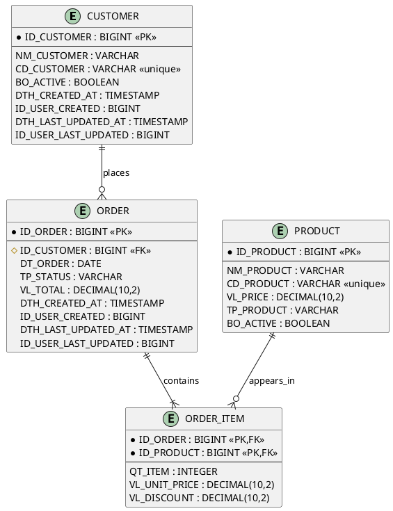

# Makuco Entity Relationship Diagram

This skill defines the **standards, rules, and conventions** for creating entity-relationship diagrams in an objective, consistent, and implementation-ready way.

> **Important:** This skill does NOT generate diagrams directly. It provides the modeling rules and standards. Diagram creation and rendering must be done using the `makuco-plantuml-diagram` skill with PlantUML ER syntax.

## Objective

- Transform business rules into a clear data model.
- Highlight entities, attributes, keys, and cardinalities.
- Avoid naming and relationship ambiguity.
- Provide standards that feed into PlantUML ER diagram generation.

## Mandatory Reference Rule

Before generating or fixing an ERD, the `makuco-plantuml-diagram` skill must be used for diagram creation. Refer to the PlantUML ER reference (`references/er_diagrams.md` inside the plantuml skill) for syntax details.

If there is any syntax uncertainty, prioritize the PlantUML ER reference documentation over old examples or contextual memory.

## Source Standards (DB1)

When creating or reviewing an ERD, apply these standards from "Product Design & Engineering Standards / Entity Relationship Diagram":

- Model the real-world domain first (entities and business concepts), not UI screens.
- Keep domain vocabulary stable and business-oriented.
- Use English names for entities and attributes.
- Prefer a physical-ready model when the project target is relational storage.
- Resolve `N:N` with associative entities.
- Keep the ERD documented and versioned as an engineering artifact.

## Mandatory Output Format

- Diagrams must be generated in **PlantUML ER syntax** using the `makuco-plantuml-diagram` skill.
- Use `@startuml` / `@enduml` delimiters.
- Use `entity` blocks with `*` for PK, `#` for FK, and `--` separator.
- Use PlantUML cardinality notation: `||` (exactly one), `|o`/`o|` (zero or one), `|{`/`}|` (one or more), `o{`/`}o` (zero or more).
- Include only elements necessary to understand the domain.

## Objective Process

1. Identify the domain and model goal (conceptual, logical, or physical).
2. List core entities with singular names and no generic terms.
3. Define essential attributes for each entity.
4. Mark keys when applicable (`PK`, `FK`, `UK`).
5. Model relationships with correct cardinality.
6. Use an associative entity to resolve `N:N` when necessary.
7. Review naming, key usage, and cardinality consistency.
8. Generate the final Mermaid diagram.

## Naming Standards (Detailed)

### General Naming Rules

- Use concrete nouns.
- Keep names singular.
- Do not use accents or spaces.
- Avoid unexplained abbreviations.
- Keep naming logic consistent across all entities.

### Entity Naming

- Use `PascalCase` for regular entities (for example: `Product`, `TaxInvoice`, `CustomerOrder`).
- For part-whole associative entities, use underscore to make composition explicit (for example: `Order_Item`, `Order_Payment`).
- For aggregation-like associative entities, use `Entity1_Entity2`, placing the stronger/more relevant entity first.

### Attribute Naming

- Use clear, self-explanatory names.
- Prefer `PascalCase` for compound names in conceptual/logical notation.
- For physical metadata-driven naming, allow strategic uppercase prefix notation (for example: `ID_PRODUCT`, `NM_PRODUCT`, `VL_TOTAL`).
- Avoid Hungarian notation for low-level type prefixes (`str`, `int`, `bool`) in business names.

### Ambiguity Control

- Avoid generic names like `Name` in large schemas.
- Prefer context-explicit names when needed:
    - Metadata style: `NM_PRODUCT`, `NM_CATEGORY`
    - Descriptive style: `ProductName`, `CategoryName`

## Strategic Attribute Metadata

Use metadata prefixes only when they produce clear technical value (automation, consistency, query readability, AI-assisted generation).

### Prefix Rules

- Strategic metadata attributes should start with a 2-3 character uppercase prefix plus underscore.
- Prefix semantics must be globally consistent in the project.
- Prefixes should be documented in the project metadata guide.

### Recommended Prefixes

- `ID_`: identifier/key (`ID_PRODUCT`, `ID_ORDER`)
- `CD_`: business code (`CD_PRODUCT`)
- `NM_`: display name/human-readable label (`NM_PRODUCT`)
- `QT_`: quantity (`QT_ITEM`)
- `VL_`: monetary value (`VL_TOTAL`)
- `PC_`: percentage (`PC_DISCOUNT`)
- `DT_`: date only (`DT_BIRTH`)
- `DTH_`: datetime (`DTH_CREATED`)
- `HR_`: time-only (`HR_START`)
- `BO_`: boolean (`BO_ACTIVE`)
- `TP_`: type/domain classifier (`TP_STATUS`)

### Key Rules

- Prefer simple primary keys whenever possible.
- Primary key naming pattern for physical models: `ID_<ENTITY>`.
- Foreign key naming pattern: keep referenced entity identity name (`ID_CLIENT`, `ID_ORDER`, `ID_PRODUCT`).
- Composite keys are allowed when justified by query performance and high-volume data access patterns.

### Mandatory Auditing Attributes (Physical Models)

For physical tables, include standard auditing fields unless there is a justified exception:

- `DTH_CREATED_AT`
- `ID_USER_CREATED`
- `DTH_LAST_UPDATED_AT`
- `ID_USER_LAST_UPDATED`

If project infrastructure already enforces another auditing standard, document and apply that standard consistently.

## Relationship and Constraint Naming

- Relationship meaning must reflect real-world business semantics.
- For physical relationship naming conventions, follow many-to-one reading order when defining FK semantics.
- Recommended FK relationship pattern for constraints/indexes: `<CHILD>_FK_<PARENT>`.
- Examples:
    - `OrderItem_FK_Order`
    - `OrderItem_FK_Product`
    - `Product_FK_Category`

Note: In Mermaid ER, relationship labels should remain business-readable. Use technical FK naming in modeling notes when needed.

## Domain and Type Consistency

- Define reusable domains for strategic metadata attributes.
- Keep domain definitions stable across the schema.
- Typical examples:
    - `BO_` -> `boolean`
    - `VL_` -> fixed precision numeric
    - `DT_` -> date
    - `DTH_` -> datetime/timestamp
    - `ID_` -> integer/long/uuid pattern defined by platform
    - `NM_` -> bounded text length pattern

## Documentation and Governance

- The ERD must have a technical owner.
- The ERD must be versioned and accessible.
- Structural pull requests should reference ERD updates.
- Tables/entities and critical attributes should include purpose notes.
- For large models, split by bounded context/subviews for readability.

## Standards and Best Practices

- Keep entities singular and business-meaningful.
- Avoid technical columns that add no domain value at the conceptual level.
- Include foreign keys as attributes only when the target is a logical/physical model.
- Avoid redundancy: if the relationship already explains the association, do not duplicate it unnecessarily.
- Prefer descriptive relationship labels (for example: `places`, `contains`, `owns`, `belongs_to`).
- Keep attribute types coherent and names stable across the diagram.
- In multiple contexts, separate entities by bounded context and avoid semantic overload.
- Keep line crossings acceptable, but avoid entities visually overlapping relationship lines.

## Cardinality and Identification Rules

- Use PlantUML Crow's Foot notation (`||`, `|o`, `o|`, `|{`, `}|`, `o{`, `}o`).
- Distinguish identifying and non-identifying relationships when relevant.
- Ensure bidirectional readability of each relationship (from A to B and from B to A).
- Validate minimum and maximum optionality carefully against business rules.

## Quality Checklist

- Do all entities have a clear purpose?
- Is there any relationship without defined cardinality?
- Is there an `N:N` that should be resolved with an associative entity?
- Is `PK` present where entity identity is required?
- Were `FK`/`UK` used with clear intent?
- Are names consistent with the domain language?
- Is the PlantUML diagram semantically valid and readable?
- Are strategic metadata prefixes (`ID_`, `NM_`, `TP_`, `BO_`, etc.) used consistently when applicable?
- Are FK names and many-to-one semantics coherent?
- Are auditing attributes defined for physical entities?
- Is the ERD documented, owned, and versioned?

## Response Template

When the user asks for ERD creation, respond in this order:

1. Adopted assumptions (short and objective).
2. Final PlantUML ER diagram (generated via `makuco-plantuml-diagram` skill).
3. Modeling notes (risks, choices, and alternatives).

## Base Example

## Metadata Notes Example

Use this pattern in modeling notes when strategic metadata is present:

- `TP_PRODUCT`: domain-coded type (for example: `RM`, `RS`, `UC`)
- `BO_ACTIVE`: must be represented as boolean and translated to localized UI labels (`Yes/No`, `Sim/Não`)
- `NM_PRODUCT`: canonical human-readable name displayed with `ID_PRODUCT` or `CD_PRODUCT` lookups
- `VL_` attributes: money-aware formatting and locale-aware currency presentation