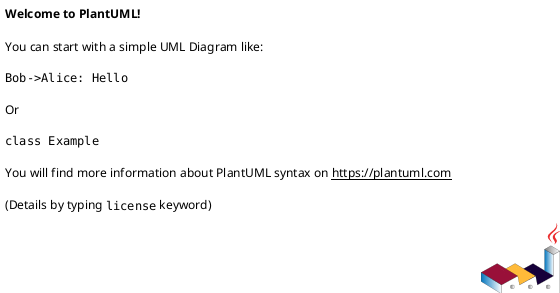
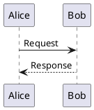
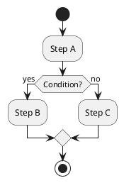
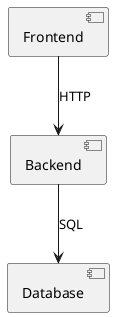

# PlantUML Diagram Code Generation

## Table of Contents

- [Purpose](#purpose)
- [When to Use This Skill](#when-to-use-this-skill)
- [Diagram Types](#diagram-types)
- [Syntax Guide](#syntax-guide)
- [Best Practices](#best-practices)
- [Syntax References](#syntax-references)

## Purpose

This skill instructs on how to generate valid and well-structured PlantUML source code from natural language descriptions. Rendering to images and file handling are **not** responsibilities of this skill — they are delegated to the MCP.

**Scope of this skill:**

1. Identify the correct diagram type from user intent
2. Produce syntactically valid PlantUML code
3. Apply appropriate styling and semantic enrichment
4. Deliver the code inline in a `puml` code block for the MCP to process

## When to Use This Skill

**Activate for:**

- Any request to create, draw, or design a diagram
- Architecture visualization (e.g., "Draw the authentication flow")
- Specific diagram types: UML (sequence, class, activity, state, component, deployment, use case, object, timing) or non-UML (ER, Gantt, mindmap, WBS, JSON/YAML, network, Archimate, wireframes)

**Output:** Always deliver the PlantUML source code in a fenced `puml` code block. Do not create files or run conversion commands.

## Diagram Types

Identify the appropriate diagram type based on user intent:

| User Intent | Diagram Type | Syntax Reference |
|-------------|--------------|------------------|
| Interactions over time | Sequence | `references/sequence_diagrams.md` |
| System structure with classes | Class | `references/class_diagrams.md` |
| Workflows, decision flows | Activity | `references/activity_diagrams.md` |
| Object states and transitions | State | `references/state_diagrams.md` |
| Database schemas | ER (Entity Relationship) | `references/er_diagrams.md` |
| Project timelines | Gantt | `references/gantt_diagrams.md` |
| Idea organization | MindMap | `references/mindmap_diagrams.md` |
| System architecture | Component | `references/component_diagrams.md` |
| Actors and features | Use Case | `references/use_case_diagrams.md` |
| Infrastructure and deployment | Deployment | `references/deployment_diagrams.md` |
| Work breakdown | WBS | `references/wbs_diagrams.md` |
| All 19 types | Navigation hub | `references/toc.md` |

## Syntax Guide

**Required delimiters:**



**Common elements:**

- Comments: `' Single line` or `/' Multi-line '/`
- Relationships: `->` (solid), `-->` (dashed), `..>` (dotted)
- Labels on arrows: `A -> B : Label text`
- Notes: `note over A : text` / `note left of A : text`

**Examples by type:**



```puml
' Class
@startuml
class Animal { +move() }
class Dog extends Animal { +bark() }
@enduml
```



```puml
' ER
@startuml
entity User { *id: int \n name: string }
entity Post { *id: int \n title: string }
User ||--o{ Post : "writes"
@enduml
```



## Best Practices

**Code quality:**
- Always include `@startuml` / `@enduml` delimiters
- Add a `' title` comment at the top to describe the diagram
- Use meaningful participant/entity names, not placeholders
- Keep diagrams focused — one concern per diagram

**Styling:**
- Apply a theme when it improves readability: `!theme cerulean`
- Use the `<style>` block for targeted customization:

```puml
@startuml
<style>
sequenceDiagram {
  arrow { LineColor DarkBlue }
}
</style>
' diagram content
@enduml
```

**Available themes:** `cerulean`, `bluegray`, `plain`, `sketchy`, `amiga`

**Semantic enrichment with Unicode symbols:**

```puml
node "☁️ Cloud" as cloud
database "💾 PostgreSQL" as db
actor "👤 User" as user
```

**Supported diagram types:**
- UML: sequence, class, activity, state, component, deployment, use case, object, timing
- Non-UML: ER, Gantt, mindmap, WBS, JSON/YAML, network, Archimate, wireframes

## Syntax References

Before generating any diagram, load the corresponding reference file to ensure correct syntax:

| Resource | Purpose |
|----------|---------|
| `references/toc.md` | Navigation hub for all 19 diagram types |
| `references/common_format.md` | Universal elements: delimiters, metadata, comments, notes |
| `references/styling_guide.md` | Modern `<style>` syntax with CSS-like rules |
| `references/unicode_symbols.md` | Unicode symbols for semantic enrichment |
| `references/sequence_diagrams.md` | Sequence diagram full syntax |
| `references/class_diagrams.md` | Class diagram full syntax |
| `references/activity_diagrams.md` | Activity diagram full syntax |
| `references/state_diagrams.md` | State diagram full syntax |
| `references/er_diagrams.md` | ER diagram full syntax |
| `references/gantt_diagrams.md` | Gantt chart full syntax |
| `references/mindmap_diagrams.md` | MindMap full syntax |
| `references/component_diagrams.md` | Component diagram full syntax |
| `references/use_case_diagrams.md` | Use case diagram full syntax |
| `references/deployment_diagrams.md` | Deployment diagram full syntax |
| `references/wbs_diagrams.md` | WBS diagram full syntax |
